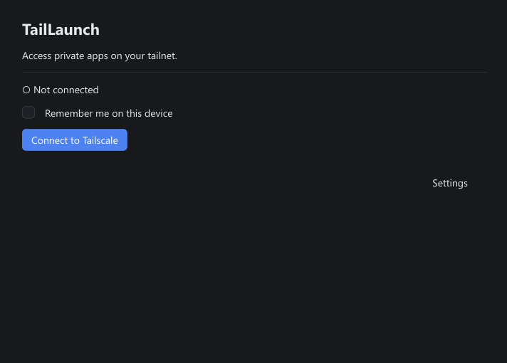
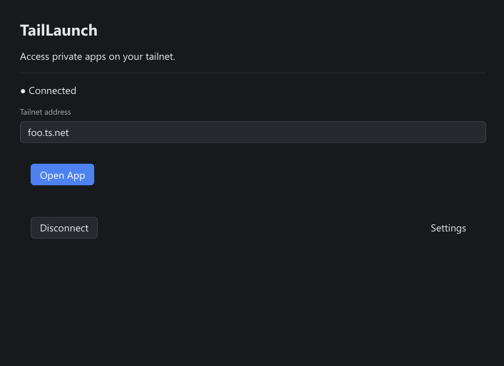
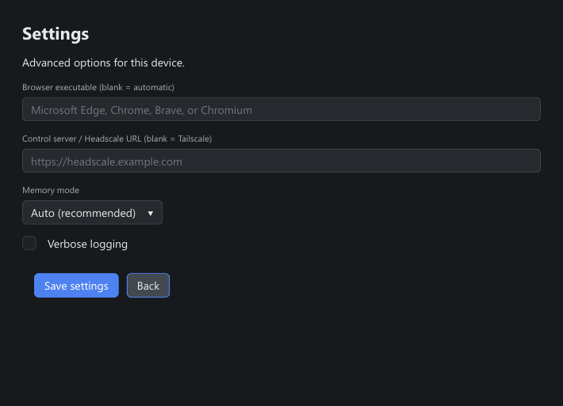

# TailLaunch

TailLaunch is a lightweight, cross-platform tailnet browser launcher. It
connects to Tailscale in userspace and opens a private web app in its own
Chromium-family app window, without installing a system VPN, TUN adapter, or
requiring administrator/root access.

TailLaunch is an independent community project and is not affiliated with
Tailscale Inc.

## GUI quick start

The normal desktop launcher is `taillaunch-gui`:

```bash
taillaunch-gui
```

Click **Connect to Tailscale**, complete authentication on the official
Tailscale page in your system browser, then enter a tailnet hostname or full
`http://`/`https://` address and click **Open App**. The GUI does not ask for
your Tailscale password.

Sessions are temporary by default. Enable **Remember me on this device** to
reuse saved identity and browser data. GUI memory mode defaults to **Auto**;
**Normal** and **Low memory**, browser selection, alternate control server,
and verbose logging are in **Settings**. Private apps open maximized in a
normal Chromium-family app window. Edge, Chrome, Brave, or Chromium must be
installed.

TailLaunch disables Tailscale's diagnostic log upload, including when you use
Headscale as the control server. The trade-off is that Tailscale support cannot
access logs from TailLaunch's embedded node. See [SECURITY.md](SECURITY.md).

## Screenshots







## CLI quick start

`taillaunch` is the command-line frontend:

```bash
taillaunch https://my-server.my-tailnet.ts.net
```

Use `--persist` to reuse saved state, `--app=false` for a full browser window,
`--low-memory` for conservative Chromium limits, or `--proxy-only` to print a
loopback proxy for another application.

## Documentation

- [Getting Started](docs/getting-started.md)
- [GUI usage](docs/gui.md)
- [CLI usage](docs/cli.md)
- [Headscale and alternate control servers](docs/headscale.md)
- [Security model](docs/security-model.md)
- [Troubleshooting](docs/troubleshooting.md)
- [Development and testing](docs/development.md)
- [Future performance benchmarks](docs/performance.md)
- [Security reporting policy](SECURITY.md)

## Release platforms

Releases publish both `taillaunch` and `taillaunch-gui` binaries for Windows,
Linux, and macOS on `amd64` and `arm64`, together with `SHA256SUMS.txt`.

## Project status

The v0.2.0 release is GUI-focused: shared CLI/GUI session logic, launcher-style
connection flow, disposable-by-default sessions, opt-in persistence,
Auto/Normal/Low memory modes, maximized app windows, and advanced settings
outside the main flow.

## License

MIT. See [LICENSE](LICENSE) and [THIRD_PARTY_NOTICES.md](THIRD_PARTY_NOTICES.md).
